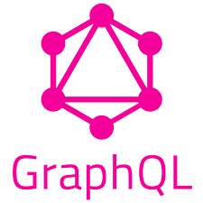

# GraphQL
##  Server API
- 요청을 하였을 때 그에 맞는 응답을 되돌려주는 창구(Endpoint)를 Web을 통해 노출한 것
- 대표적인 예로 REST API, GraphQL

## GraphQL이란?
<br>
- 페이스북에서 만든 API를 위한 쿼리 언어
- 타입 시스템을 사용하여 쿼리를 실행하는 서버사이드 런타임
- 특정 데이터베이스나 플랫폼에 종속적이지 않음
- 쿼리 언어이지만 일반적인 SQL과는 목적이 다르다
GraphQL : 웹 클라이언트가 데이터를 서버로부터 효율적으로 가져오는 것이 목적 
SQL :  데이터베이스 시스템에 저장된 데이터를 효율적으로 가져오는 것이 목적

## GrqphQL 타입 시스템 개념
- 클라이언트와 서버 간의 데이터 구조와 형태를 명확하 정의하고, 이를 기반으로 쿼리와 응답을 검증하는 역할 = 전체적으로 데이터를 정의하고 검증하는 체계를 의미
- 타입과 스키마라는 두가지 주요 구성 요소로 나뉜다.
- 프로그래밍 언어의 데이터 타입 개념과 유사
- 데이터의 형태를 스키마를 통해 정의 
### 1. 타입(Types)
- GrqphQL 데이터는 타입으로 정의
- 사용자 정의 타입(Custom Types)를 만들 수도 있음

```sql
type User {
    id: ID!
    name: String
    age: Int
    email: String
}
```
### 2. 스키마(Schema)
- GraphQL은 서버는 스키마를 기반으로 동작
- 서버에서 제공하는 데이터 모델과 요청 가능한 필드를 명확히 정의
- 클라이언트는 스키마를 참조하여 요청 가능한 데이터를 알 수 있다
- 서버는 클라이언트 요청을 스키마와 비교하여 유효성을 검증
```sql
type Query {
    getUser(id: ID!): User
}
```
#### GrqphQL 유형(Type)
https://minjin-note.tistory.com/24

## Rest API의 차이
### 1. URL 엔드포인트
- GraphQL : 단일 엔드포인트
- Rest : 여러 엔드포인트
### 2. 데이터 반환 방식
- GraphQL : 클라이언트가 요청한 데이터만 반환
- Rest : 정해진 데이터 구조(Over-fetching 발생 가능)
```memo
 * Over-fetching이란?
  - 필요한 데이터 이상의 데이터를 가져오는 것
```
### Rest : GET /users/1
```json
{
    "id": 1,
    "name": "김연동",
    "email": "dusehd0525@naver.com"
}
```
### Rest : GET /users/1/posts
```json
{
[
    {
        "id": 101,
        "title": "GraphQL1권",
        "content": "GraphQL란 뭘까"
    },
    {
        "id": 102,
        "title": "REST API1권",
        "content": "REST API란 뭘까?"
    }
]
}
```
### GraphQL 요청
```json
query {
    user(id: 1) {
        name
        email
        posts {
            title
            content
        }
    }
}
```
### GraphQL 응답
```json
{
    "data": {
        "user": {
            "name": "김연동",
            "email": "dusehd0525@naver.com",
            "posts": [
                {
                    "title": "GraphQL1권",
                    "content": "GraphQL란 뭘까"
                },
                {
                    "title": "REST API1권",
                    "content": "REST API란 뭘까?"
                }
            ]
        }
    }
}

```
### 3. 유연성
- GraphQL : 클라이언트 요청에 맞춰 데이터 조합 가능
- Rest : 고정된 데이터 구조
### 4. 확장성
- GraphQL : 스키마 확장으로 간단히 추가 가능
- Rest : 새로운 데이터 추가 시 엔드포인트 수정 필요

##  Rest와 GraphQL 작성방식 차이
### 1. Rest
### Controller
```java
@GetMapping("/mypage")
    public ResponseEntity<MemberInfoResponse> getMemberInfo(@AuthenticationPrincipal CustomOAuth2User customOAuth2User) {
        Long memberId = customOAuth2User.getmemberId();

        MemberInfoResponse memberInfoResponse = memberService.getMemberInfo(memberId);
        return ResponseEntity.ok(memberInfoResponse);
    }
```
### Response
```java
public class MemberInfoResponse {
    private String memberName;
    private String personalColor;
    private String profileFilePath;
}
```

### Service
```java
public MemberInfoResponse getMemberInfo(Long memberId) {
        Member member = findMemberById(memberId);
        return new MemberInfoResponse(
                member.getMemberName(),
                member.getPersonalColor(),
                member.getProfileFilePath()
        );
    }
```

### 2. GraphQL
### GraphQL 스키마
- Query: 클라이언트가 요청 가능한 루트 타입
- MemberInfoResponse: 서버에서 반환할 데이터의 구조를 정의
```java
type Query {
    getMemberInfo: MemberInfoResponse
}

type MemberInfoResponse {
    id: ID!
    name: String
    email: String
    profileImageUrl: String
    joinedDate: String
}

```
### 리졸버(Resolver)
- GraphQL 요청을 처리하는 백엔드 함수로, 기존의 memberService.getMemberInfo 메소드를 호출
```java
@Component
public class MemberResolver implements GraphQLQueryResolver {

    private final MemberService memberService;

    public MemberResolver(MemberService memberService) {
        this.memberService = memberService;
    }

    public MemberInfoResponse getMemberInfo(CustomOAuth2User customOAuth2User) {
        Long memberId = customOAuth2User.getmemberId();
        return memberService.getMemberInfo(memberId);
    }
}
```

## 결과
### 요청
```sql
query {
    getMemberInfo {
        id
        name
        email
        profileImageUrl
        joinedDate
    }
}
```
### 응답
```sql
{
    "data": {
        "getMemberInfo": {
            "id": "1",
            "name": "김연동",
            "email": "dusehd0525@naver.com",
            "profileImageUrl": "https://~~url~~~.jpg",
            "joinedDate": "2025-01-16"
        }
    }
}

```