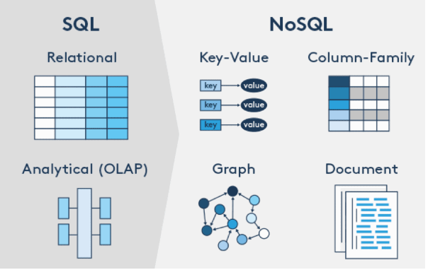
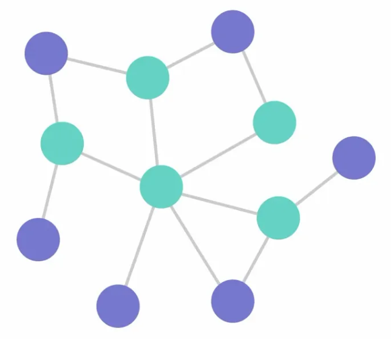
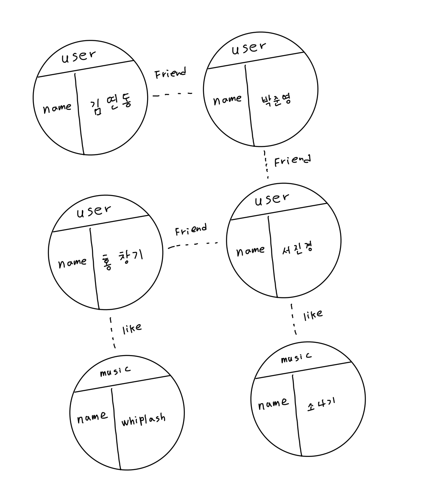

# GraphDB 
### 관계형 DB가 데이터를 집계하고 처리하는데 최적화되어있으면 그래프 DB는 탐색과 쿼리에 최적화
 <br>
#
 <br>
- 데이터를 점 또는 노드(Vertex or Node)과 점을 잇는 선(Edge)으로 표현한 데이터베이스
- 노드는 개체(Entity)를 나타내고, 엣지는 노드 간의 관계(Relationship)을 표현
- 그래프 구조로 되어있기 때문에 두 객체 사이의 관계를 표현하기에 최적화
- 객체끼리 엣지로 연결되어 있기 때문에 여러 컬렉션에 흩뿌려진 데이터에 접근하기 쉬움
- 그래프 횡단을 통해 기존 RDBMS와 NoSQL DB에서 비효율적이거나, 절대 쿼리로 만들 수 없었던 데이터들을 뽑을 수 있음
- 데이터 분석의 깊이가 깊어질수록 진가를 발휘
```memo
내 친구의 친구가 좋아하는 영화의 감독이 만든 다른 영화들의 주연들의 묵록
```

## GraphDB의 장점
### 1. 유연성
- 데이터 모델을 변경할 필요 없이 새로운 데이터 요구 사항에 대응 가능
- 노드 및 엣지 간의 관계를 유연하게 조작 가능

### 2. 높은 성능
- GraphDB는 쿼리 성능이 뛰어나며, 연결된 데이터를 빠르게 검색 가능
- 일반적으로 관계형 데이터베이스보다 훨씬 더 빠른 성능을 제공

### 3. 복잡한 쿼리 지원
- GraphDB는 매우 복잡한 쿼리를 처리 가능
- 여러 노드 및 엣지 간의 복잡한 관계를 쉽게 쿼리 가능

### 4. 확장성
- Graph DB는 분산 환경에서 확장이 용이
- 데이터베이스의 성능을 높이기 위해 서버를 추가하거나 클러스터링 가능

## 사용 사례
### 1. 소셜 네트워크
- 사용자 관계와 상호작용을 그래프 모델로 관리
### 2. 추천 시스템
- 그래프 기반 추천 알고리즘을 쉽게 구현
### 3. IoT 데이터 저장소
- 복잡한 데이터 모델을 효율적으로 관리
### 4. 로그 및 분석
- 텍스트와 문서 데이터 관리

## Cypher Query
- 사이퍼(Cypher)는 식으로 나타내는 그래프의 효율적인 질의를 위한 그래프 질의어
- Create와 Match문이 가장 대표적인 구문

### Cyhper - Create
```cyhper
CREATE (김연동:Person {name: "김연동", age: 25})
// Person이라는 라벨을 가진 노드를 생성
// 노드의 값은 name: 김연동, age: 25
CREATE (song1:Song {title: "소나기", artist: "선재"})
// Song 이라는 라벨을 가진 노드를 생성
// 노드의 값은 title: 소나기, artist: 선재
CREATE (김연동)-[:LIKES]->(song1);
// 김연동과 song1(소나기) 사이에 LIKES라는 관계를 생성
```
- Create문에서 Person 앞부분의 김연동은 Alias(별칭)을 의미
- Song도 마찬가지
### 중복방지
```cyhper
MERGE (김연동:Person {name: "김연동"})
MERGE (song1:Song {title: "소나기", artist: "선재"})
MERGE (김연동)-[:LIKES]->(song1);
```
- CREATE는 항상 새 노드를 만들어 중복이 생길 수 있다
- MERGE를 사용하면 기존 노드를 재사용하고 중복 생성 방지할 수 있다.

### Alials 사용
```cypher
CREATE (:Person {name: "김연동", age: 25})
CREATE (:Song {title: "소나기", artist: "선재"})
CREATE (:Person {name: "김연동"})-[:LIKES]->(:Song {title: "소나기"});
```
- 위 쿼리문과 비슷하게 작성하였지만 별칭을 사용하지 않으면 사용이 어려움
- 마지막 쿼리문의 경우 중복노드 등의 이유로 어떠한 노드를 연결해야할지 과정이 모호해짐

### Match
```cypher
MATCH (김연동:Person {name: "김연동"})-[:LIKES]->(song:Song)
// Person 라벨을 가진 노드 중 name: 김연동을 찾음
// 김연동 노드에서 LIKES 관계로 연결된 Song을 찾음
RETURN song.title, song.artist;
// song노드의 title과 artist를 반환
```
- 데이터 조회
- 
## 그래프 분석의 원리 예제
 <br>
- 관계랑 노드는 추가할 떄마다 이어붙히는 느낌
```memo
친구의 친구가 좋아하는 음악 탐색
1. 김연동의 친구 박준영
2. 박준영의 친구 서진경
3. 서진경이 좋아하는 음악은 소나기

친구의 친구의 친구가 좋아하는 음악 탐색
1. 김연동의 친구 박준영
2. 박준영의 친구 서진경
3. 서진경의 친구 홍창기
3. 홍창기가 좋아하는 음악은 Whiplash
```