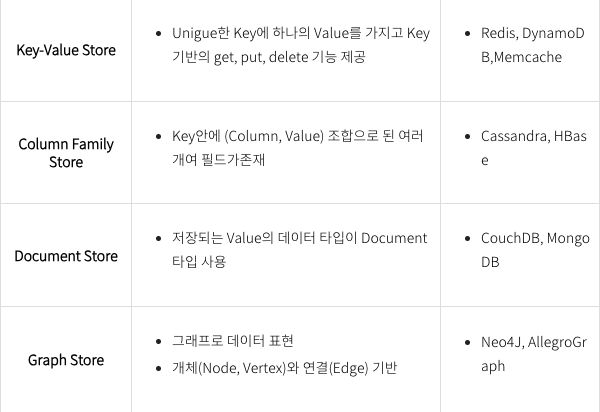
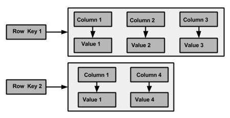
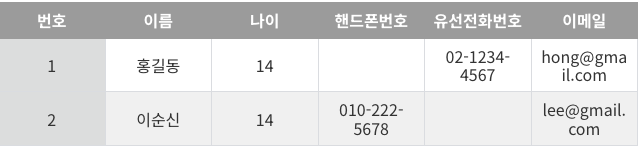
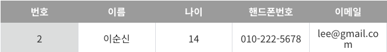

# NoSQL이란?
 <br>
- Not Only SQL 또는 Non-Relational Operational DataBase의 약자로 비관계형 DB
- DBMS와 같은 관계형 데이터 모델을 지양하며 대량의 분산된 비정형 데이터를 저장하고 조회하는데 특화된 DB
<br><br>

# column-familyDB
 <br>

## column-familyDB이란?
- NoSQL 데이터베이스의 한 종류로, 데이터를 행(Row) 단위가 아닌 컬럼(Column) 단위로 저장하는 방식
- 대규모 분산 시스템에서 데이터를 효율적으로 저장하고 빠르게 처리할 수 있도록 설계
- RDBMS의 테이블과 유사하지만 좀 더 유연한 구조 <br>
⭐️ RDBMS에서는 테이블의 스키마(컬럼 구조)가 고정, Column-Family DB에서는 각 행(Row)이 서로 다른 컬럼을 가질 수 있음

## column-familyDB의 기본 구조
- 데이터는 Row(행) 단위로 저장
- 각 Row는 하나 이상의 Column Family(컬럼 패밀리)를 가짐
- 각 Column Family는 여러 개의 Column(컬럼)을 포함
- 각 Column은 별도로 Key-Value 형식으로 저장
- 각 Row는 같은 Column Family를 가지고 있지만, 컬럼 구성은 다를 수 있음
- 단 join은 불가능함

## column-familyDB 구성요소
### Column-family
- Column들을 물릭적으로 배치
- 각 Row들은 같은 ColumnFamily를 가짐
### Row
- Row Key와 하나 또는 여러 개의 Column들로 구성
- Row Key를 이용해 문자 정렬
### Row Key
- Row 식별자, Row key값 수로 정렬
- 검색시 사용되는 기본 키
### Column
- key-value 쌍으로 하나의 Row에 여러 Column 저장
- 항상 Timestamp 값이 함께 저장
### Timestamp
- value와 함께 쓰여지며, value의 버전을 위해 식별자로 활용

## column-familyDB 예시
 <br><br>
 <br><br>
 <br><br>
```memo
// Cassandra DB 스타일
Keyspace: student_db // 카산드라에서 하나 이상의 테이블을 포함하는 단위 - 데이터베이스 개념
  ├── ColumnFamily: student
        ├── Row: "Row Key1"
        │      ├── name: "홍길동"
        │      ├── age: 14
        │      ├── telephone: "02-1234-4567"
        │      ├── email: "hong@gmail.com"
        │
        ├── Row: "Row Key2"
               ├── name: "이순신"
               ├── age: 14
               ├── phone: "010-222-5678"
               ├── email: "lee@mail.com"
               
-------------------------------------------------------
            ├── Row: "Row Key3"
               ├── name: "김연동"
               ├── location: "시흥"                 

```

## column-familyDB 장점
### 확장성
- 분산 시스템에서 데이터를 효과적으로 처리 가능
- 클러스터 노드를 추가하여 확장 가능
### 성능
- 대량의 데이터를 빠르게 읽고, 쓰기위해 최적화된 구조
### 유연성
- 스키마가 고정되어 있지 않기 때문에 다양한 형태의 데이터 저장 가능

## column-familyDB 종류와 유형
### HBase
- 하둡 기반 동작, 아파치 라이선스, 빅데이터 분산처리
### Cassandra
- 구글 Bigtable + Dynamo 분산 기술 결함
### Hypertable
- 구글 Bigtable 아키텍처 기반으로 구현, 성능우수
