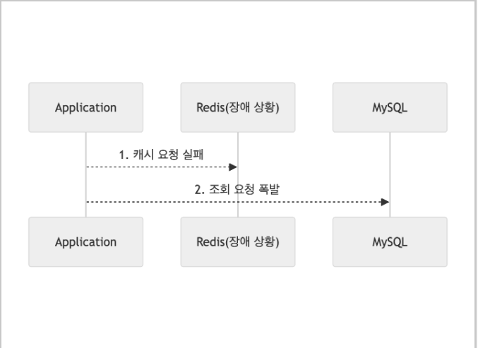

# Cache를 사용하는 이유
### 데이터를 빠르게 읽어올 수 있다
- DB에 직접 요청하는 것보다 RAM에서 가져오는 것이 더 빠름
### DB는 시스템을 확장하기 어렵다
- DB의 부하를 최소화하고 확장 필요성을 줄이는 것이 바람직
- Cache를 사용하여 높은 캐시 히트율을 유지하면 확장없이 대용량 트랙픽 처리 가능
### 대용량 트래픽 처리
- DB에 직접 접근하는 요청을 줄여서 부담을 덜어준다
- 트래픽피크(Spike) 대응
```memo
⭐️ 트랙픽피크란?
- 특정 순간(이벤트, 세일 등)에 트래픽이 폭발적으로 증가하는 상황
```
<br>

# 캐시로 인한 장애 유형
## 캐시 쇄도(Cache Stampede)
 <br>
- 캐시 미스가 동시에 많이 발생하면 데이터베이스에 부담이 증가하는 상황
- 캐시가 전부 정확히 같은 시간에 만료되도록 구현할 때 자주 발생
```memo
캐시 히트 : 캐싱된 데이터가 있는 것 
캐시 미스 : 캐싱된 데이터가 없는 것
```
### 어떻게 해결하는가? - 지터(Jitter)
```memo
전자공학 - 전자 신호를 읽는 과정에서 발생하는 짧은 지연시간
```
- 캐시 만료 시간을 무작위(Random)로 조정하여 동시 만료를 방지 
- 캐시 쇄도 시에도 DB부하를 균등하게 분산
- 서비스에 맞게 지터 시간 설정

## 캐시 관통(Cache Penetration)
 <br>
- DB에서 읽었지만 캐싱되지 않는 상황
- DB에 불필요한 요청이 발생
- "값이 없음"을 캐싱하지 않은 경우 발생

### 어떻게 해결하는가? - 널 오브젝트 패턴(Null Object Pattren)
- 객체 타입 : 부재를 뜻하는 객체 선언
- 원시 타입 : 부재를 뜻하는 특정 값 지정
- "존재하지 않는 데이터"도 캐시에 저장하여 불필요한 DB 요청을 방지
- 예를 들어 특정 키가 없을 경우, Redis에 ‘NULL’ 값을 일정 시간 캐싱  

## 캐시 시스템 장애
 <br>
- 캐시 시스템에 장애 발생
- DB 과부하 위험성

### 어떻게 해결하는가? - 대체 작동(Failover)
- 핵심 기능을 제외한 부가 기능들의 일시 중단
- 캐시 시스템이 복구되는 동안 DB는 핵싱 기능만 처리
- 부가 기능은 사용자들에게 대체 UI를 제공 또는 양해를 구하는 것이 현실적인 대응


## 핫키(Hotkey)  만료
 <br>
- 핫키가 만료되어 여러 요청이 동시에 DB로 향하는 것
```memo
⭐️ 핫키란?
- 많은 요청이 집중되는 키
```

### 어떻게 해결하는가? - 분산 락(Distributed Lock)
- 캐시를 애플리케이션 서버 간 공유 자원으로 보고, 캐시 미스 발생 시 락을 설정하고 캐싱 후 락 해제
- 한 번의 쓰기 작업만 허용
- Redis에서는 레드락 알고리즘 라이브러리가 제공되어 쉽게 사용 가능

### 어떻게 해결하는가? - 백그라운드 캐싱
- 캐시 만료 기한을 없애거나 백그라운드에서 주기적으로 또는 만료 전 갱신하여 DB 부하 방지
- 예를들어 Redis에서 TTL이 다 되기 전에 미리 데이터를 갱신 (Write-Behind 전략) 

## 읽어보면 좋을 것 같아요
https://toss.tech/article/cache-traffic-tip

