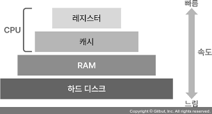

# [Redis#2] Cache란?

나중 요청에 대한 결과를 미리 저장했다가 빠르게 사용하는 것

**🤚어디에 저장해야 빠를까?**

## **메모리 계층구조**

#### CPU 캐시

- SRAM
- 매우 빠름
- 매우 비쌈
- 저장공간 작음

#### RAM(Main Memory)
- DRAM
- 적당히 빠름
- 적당히 비쌈
- 저장공간 적당히 큼
- 어느 위치에 저장된 데이터든지 동일한 시간이 소요됨
- 휘발성
- 디스크보다 높은 I/O 성능을 가짐

#### 하드디스크
- SSD/HDD 기반
- 비교적 느림
- 비교적 저렴함
- 저장공간 매우 큼
- 비휘발성, 데이터 영속성 보장

➡️ RAM은 주기억장치로, 데이터 처리에 병목 현상과 대기 시간 X

➡️ Disk는 데이터를 페이지 단위로 조회, 따라서 원하는 데이터를 찾을 때까지 지연이 발생

➡️ In-Memory DB의 탄생 : DB보다 더 빠른 Main Memory에 더 자주 접근하고 덜 자주 바뀌는 데이터를 저장하자!

## **In-Memory DB**

- 실시간 데이터 처리와 동일한 빠른 조회를 위해 활용
- 보통 1ms 이하의 응답시간
- 스케일 아웃으로 데이터 분산 처리 가능
- 대표적으로 Redis, Memcached 존재

### _Redis VS Memcached_

|  | Redis | Memcached |
|--------|--------|--------|
| **Data Type** | String, Set, Sorted Set 등 | String |
| **Value** | 512MB | 1MB |
| **Thread** | Single | Multi |
| **Persistence Support** | O | X |
| **Transaction Support** | O | X |

 

> _[Redis 데이터 복구]_
  - RDB 방식
  - AOF 방식