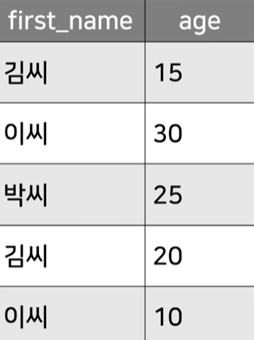
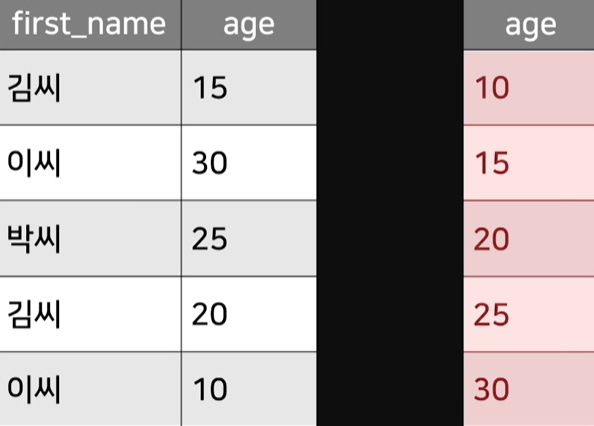
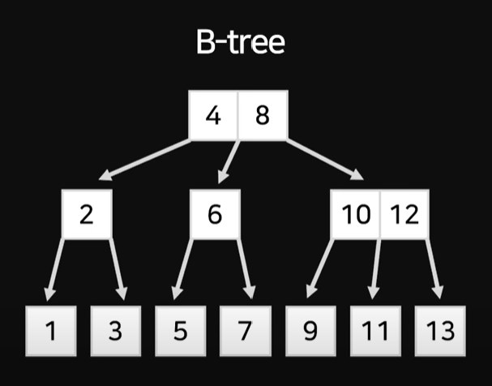
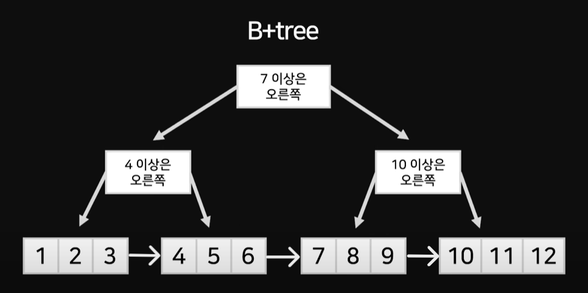
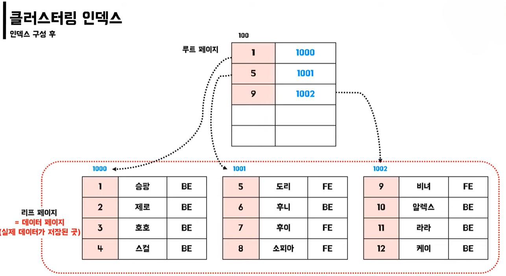
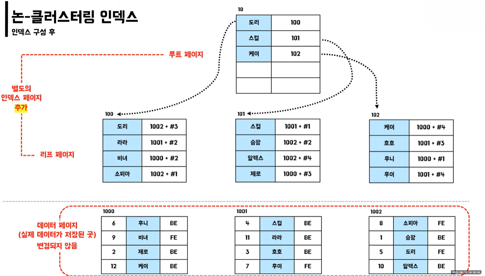
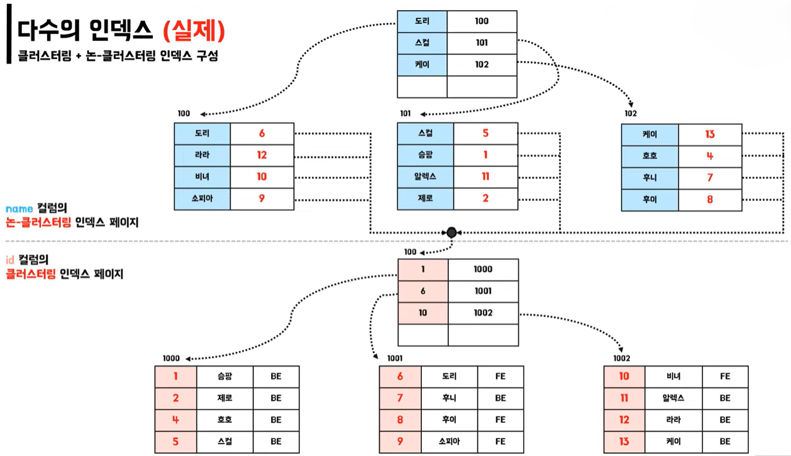
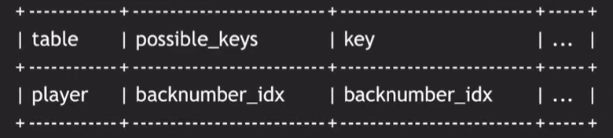
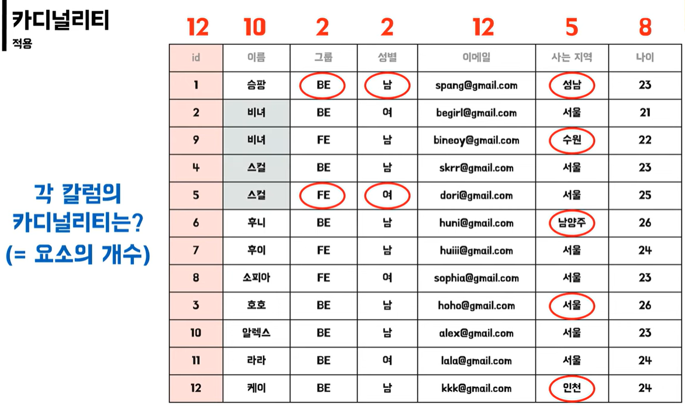

# [DB#1] Index란?

- 데이터베이스 테이블에 대한 **검색 성능을 향상**시키는 자료구조
- `WHERE`, `JOIN`, `GROUP BY`, `ORDER BY` 등 행의 값을 기준으로 수행되는 SQL 명령어에 대한 효율을 높여줌

**_Q1. 위 테이블에서 age가 20인 행들을 찾고 싶다면?_**

`SELECT * FROM table WHERE age = 20;`

모든 행을 하나씩 확인하며 age가 20인 값들을 추출함

**_Q2. 만약 행이 1억개라면?_**

age가 20인 값들을 찾기 위하여 1억개의 행을 모두 탐색해야 함

➡️ Index를 활용하면 전체 테이블을 탐색하지 않고도 검색을 마칠 수 있음 

**_Q3. age 컬럼에 인덱스를 생성한다면?_**

#### 생성
1. 인덱스를 생성할 컬럼인 age를 복사
2. 해당 컬럼의 값 정렬한 인덱스 테이블 생성

#### 활용
1. 이분탐색을 통해 빠르게 목표 값 탐색
2. 값을 찾았을 경우, Index와 연결된 원본 테이블의 행 위치 반환

## 특징

- 항상 최신의 정렬 상태를 유지
- Index 역시 하나의 데이터베이스 객체에 해당함

## 자료구조

### 1. [B-Tree](https://github.com/Ansanssafy/Ssafy_Study/blob/main/Algorithm/B-Tree_B%2BTree/B-Tree_B%2BTree.md)

- 각 노드에 한개 이상의 값을 저장

### 2. B+Tree

- 중간 노드는 데이터가 포함된 위치에 대한 가이드 역할 수행
- 실제 값들은 리프 노드에만 존재하며 각 리프 노드는 LinkedList 형태로 연결되어 있음

## 종류

#### 1. 클러스터링 인덱스
- 실제 데이터와 같은 무리의 인덱스  EX) 실제 데이터가 정렬된 사전
- Table의 PK 컬럼

_ID 컬럼에 Index를 적용한다면?_

1. PK를 기준으로 데이터 정렬
2. 정렬된 데이터 페이지를 기준으로 루트 페이지 생성 → B-Tree 구조
3. 루트 페이지의 값은 데이터 페이지(=리프 페이지)의 주소를 의미함

**[특징]**
- 실제 데이터 자체가 정렬
- 테이블당 1개만 존재 가능
- 리프 페이지가 데이터 페이지
- 아래의 제약 조건시 **자동** 생성
    1. `primary key` : 우선 순위
    2. `unique` + `not null`

#### 2. 논클러스터링 인덱스(보조 인덱스, 세컨더리 인덱스)
- 실제 데이터와 다른 무리의 별도의 인덱스  EX) 도서의 맨 뒤에 수록된 별도의 색인 페이지
- Table의 Unique 제약 조건이 걸린 컬럼

_Name 컬럼에 Index를 적용한다면?_

1. Name을 기준으로 정렬
2. 실제 데이터 페이지와 별도의 인덱스 페이지 생성 → B-Tree 구조
3. 루트 페이지의 값은 인덱스 페이지의 주소를 의미함
4. 도리의 `1002 + #3`은 `실제 데이터 페이지 + 행 번호`를 의미함

**[특징]**
- 실제 데이터는 그대로
- 별도의 인덱스 페이지 생성 → 추가 공간 필요
- 테이블당 여러 개 존재
- 리프 페이지에 실제 데이터 페이지의 주소를 담고 있음
- 생성 방법
    1. `unique` : 자동 생성
    2. `CREATE UNIQUE INDEX index_name ON table(column);` : 수동 생성(컬럼 내에 중복 X)
    3. `CREATE INDEX index_name ON table(column);` : 수동 생성 (컬럼 내에 중복 O)

**_🤚클러스터링 인덱스와 논클러스터링 인덱스를 함께 사용한다면?_**

ID 컬럼에 클러스터링 인덱스 + Name 컬럼에 논클러스터링 인덱스

- Name 컬럼의 인덱스 테이블에 ID 컬럼의 실제 데이터 주소가 저장되는 것이 아닌, **실제 데이터의 ID 행 값**이 저장됨

_Q1. Name이 '라라'인 행을 찾는다면?_

1. Name 인덱스 페이지에서 '라라' 탐색
2. 라라의 Value에 해당하는 12를 ID 인덱스 페이지에서 탐색

_Q2. 왜 논클러스터링 인덱스인 Name에 주소값으로 저장하지 않을까?_

1. ID가 3인 행인 추가된다고 가정
2. ID 인덱스 테이블은 항상 정렬되어야 하기 때문에, ID가 2인 테이블 아래로 추가되어야 함
3. 4, 5번 행에 대해 페이지 분할이 발생 → Name 인덱스 페이지의 주소값이 변경되어야 함

➡️ 두 종류의 인덱스를 함께 사용할 때는, 논클러스터링 인덱스 페이지의 리프 페이지 역시 **컬럼의 실제 값**이 저장됨

## 명령어(MySQL)
|  | 명령어 |
|--------|--------|
| **생성** | `CREATE (UNIQUE) INDEX index_name ON table(column1, column2, ...);` |
| **조회** | `SHOW INDEX FROM table;` |
| **사용 인덱스 확인** | `EXPLAIN 명령어;` |
| **사용 인덱스 지정(권장)** | `SELECT * FROM table USE INDEX(index_name) WHERE 조건;` |
| **사용 인덱스 지정(지정)** | `SELECT * FROM table FORCE INDEX(index_name) WHERE 조건;` |

_* EXPLAIN이란?_

특정 컬럼에 두 개 이상의 인덱스가 걸려있을 경우, 실제 조회에 어떤 인덱스가 사용됐는지 확인할 수 있는 명령어

- possible_keys : 명령어에 대해 사용 가능한 key들
- key : 실제 명령어를 수행하며 사용된 키

## 적용 기준

1. 카디널리티가 높은 것 = 중복 수치가 낮은 것

    

    위의 테이블을 기준으로 ID, 이메일 등이 될 수 있음
2. WHERE, JOIN, ORDER BY 절에 자주 사용되는 컬럼
    - 조건 절이 없다면 인덱스는 사용되지 않음
3. INSERT, UPDATE, DELETE가 자주 발생하지 않는 컬럼
4. 규모가 작지 않은 테이블

## 활용시 주의할 점

1. 인덱스 생성시 저장공간이 추가되므로 신중한 사용 필요
2. 삽입, 삭제, 수정이 잦은 컬럼에 적용할 경우 부하로 인한 성능 저하가 나타날 수 있음
3. PK의 경우 자동 생성되기 때문에 추가로 생성할 필요 없음