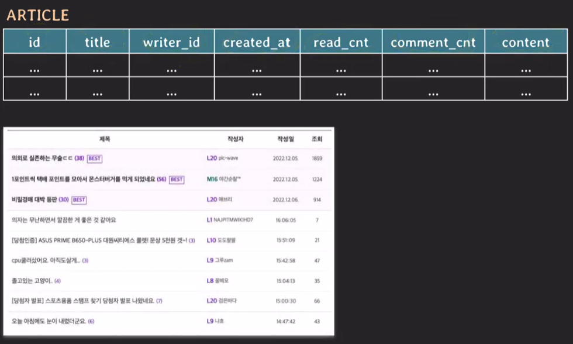
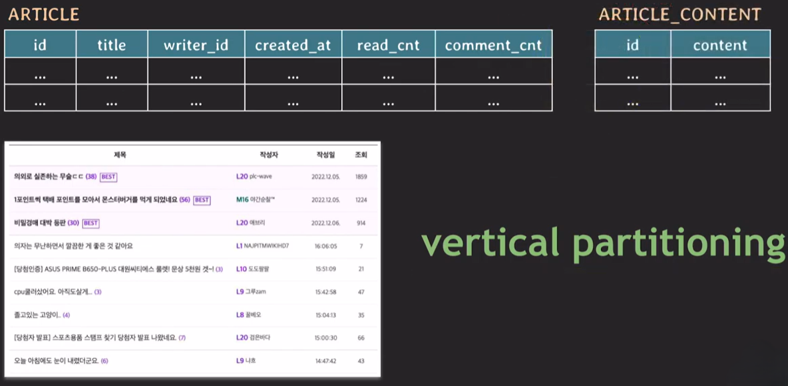
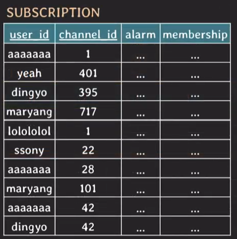
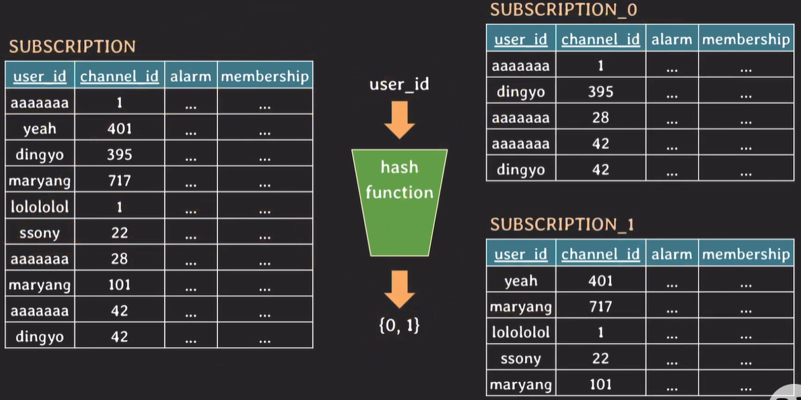

# [DB#2] 파티셔닝이란?

- 하나의 논리적 테이블을 여러 개의 물리적 테이블들로 나누는 것
- 즉, 하나의 DB 테이블을 더 작은 여러 개의 테이블로 나누는 것

## 등장 배경

- 서비스 크기가 점점 커짐에 따라, 데이터베이스에 많은 양의 정보가 쌓임
- 용량의 한계에 따른 성능 저하 이슈를 해결하기 위해 '파티셔닝'의 개념 등장

## 종류

- Vertical Partitioning
- Horizontal Partitioning

## Vertical Partitioning

- column을 기준으로 테이블을 나누는 방식
- 따라서 정규화도 Vertical Partitioning의 일종임



**_Q1. 게시글 목록 조회에서 BackEnd 동작 과정?_**

```SQL
SELECT id, title, ..., comment_cnt
FROM article
WHERE ...
```

- 특정 조건을 만족하는 글들을 조회하나, 현재 상태에서 content는 필요없음
- 실제 DB의 동작 과정을 살펴보면 HDD/SSD에서 실제 데이터 모두에 접근함
- 따라서 일반적으로 사이즈가 매우 큰 content I/O에 부담을 주어 조회 성능에 영향을 미침

➡️ Vertical Partitioning 수행



### 목적
---

- 민감 정보에 대한 접근 제한
- 자주 사용되거나 사용되지 않는 속성만을 모아놓기 위함

### 주의할 점 
---

- 이미 정규화가 수행된 테이블이더라도, 성능 향상을 위해 Vertical Partitioning이 추가적으로 일어날 수 있음

## Horizontal Partitioning

- row를 기준으로 테이블을 나누는 방식



**_Q1. 위 테이블이 가질 데이터의 최대치는?_**

- users : N
- channels : M
- 최대 구독 : N * M

**_Q2. 이후로 테이블의 크기가 커진다면?_**

- 테이블의 크기가 커질수록 인덱스의 크기도 함께 커짐
- 테이블에 I/O가 있을 때마다 **인덱스에서 처리되는 시간도 늘어남**
- 규모가 큰 서비스의 경우 시간이 지날수록 성능 저하를 겪음

➡️ Horizontal Partitioning 수행

#### Hash-based Horizontal Partitioning



_[Hash Funtion]_
- Input : user_id ← **partition key**
- Output : 0 또는 1 (더 많은 값으로 분리 가능)

**_Q1. user_id가 1인 사용자가 구독한 채널 정보를 모두 조회하고 싶다면?_**

- Hash Funtion을 통해 user_id의 결과 값 확인
- 결과 값 테이블을 찾아가 조회 수행

**_Q2. channel_id가 1인 채널을 구독한 사용자를 모두 조회하고 싶다면?_**

- 전체 테이블을 조회해야함

➡️ 사용 패턴에 따라 가장 유용한 partition key를 설정해야 함

### 주의할 점
---

- Hash Funtion의 결과로 데이터가 균등하게 분배될 수 있도록 정의
- Hash-based는 한번 분리될 경우, 이후 파티션을 추가하기에 까다로움

## 분할 기준(Partition Key)

특정 행의 값을 기준으로 두기 때문에, Horizontal Partitioning에서 쓰이는 기준임

#### 1. Range Partitioning

- 연속적인 숫자, 날짜 기준
- 분할 키 값이 범위 내에 있는지 여부로 판단

#### 2. List Partitioning

- 각 목록에 들어있는 값 기준
- 영화의 카테고리, 유저 성별, 부서 등의 Column을 기준으로 둘 때 사용
- 특정 파티션에 저장될 값에 대한 명시적 제어 가능

#### 3. Hash Partitioning

- Hash Funtion에 의한 파티셔닝
- 균등한 데이터 분할 가능
- 파티셔닝 진행 이후, 특정 데이터가 어떤 테이블에 존재하는지 알기 어려움